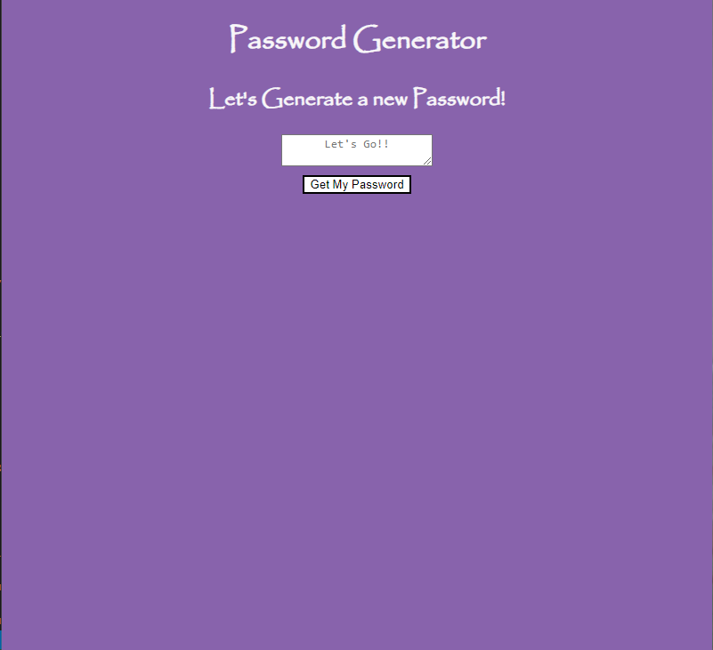
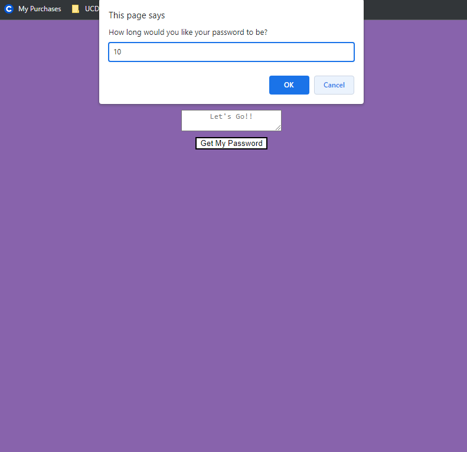
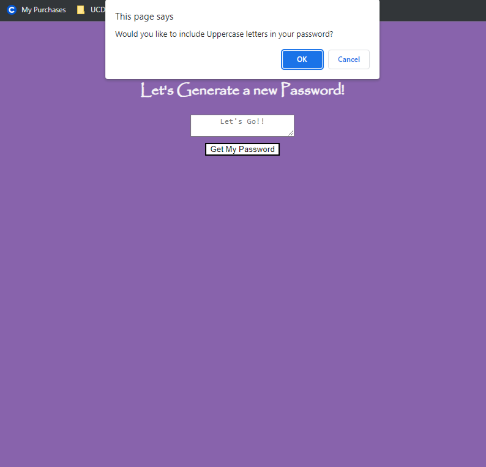
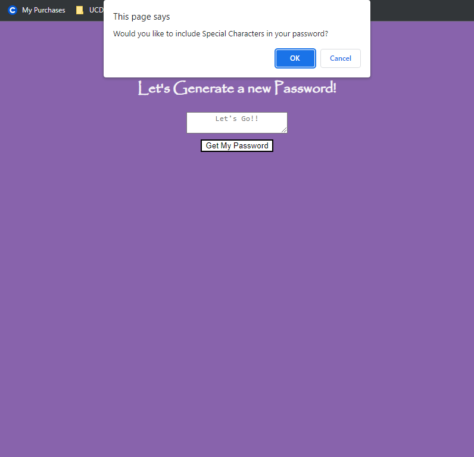

# PASSWORD GENERATOR
**Password Generator** is an application built using HTML, CSS, JS and prettier.


## Images of the deployed app:
***

## Home Page


## User inputs the length of their desired password


## User decides whether to include lower case letters or not


## User decides whether to include upper case letters or not


## User decides whether to include special characters or not


## Returned password


## User Story

```
AS AN employee with access to sensitive data
I WANT to randomly generate a password that meets certain criteria
SO THAT I can create a strong password that provides greater security
```

## Acceptance Criteria

```
GIVEN I need a new, secure password
WHEN I click the button to generate a password
THEN I am presented with a series of prompts for password criteria
WHEN prompted for password criteria
THEN I select which criteria to include in the password
WHEN prompted for the length of the password
THEN I choose a length of at least 8 characters and no more than 128 characters
WHEN asked for character types to include in the password
THEN I confirm whether or not to include lowercase, uppercase, numeric, and/or special characters
WHEN I answer each prompt
THEN my input should be validated and at least one character type should be selected
WHEN all prompts are answered
THEN a password is generated that matches the selected criteria
WHEN the password is generated
THEN the password is either displayed in an alert or written to the page
```
  ## Features
  ***
  
  Features of the deployed application and repository are as follows:

  The user is able to pick their password length, whether to include upper case letters, lower case letter or sepcial characters.

  ## TECHNOLOGY USED
  ***
    HTML 
    CSS 
    JS 
    prettier
 

## THE DEPLOYED REPO CAN BE FOUND AT THE FOLLOWING URL:
***
 [Click here to view the deployed project](https://lycanchic.github.io/Password-Generator/)

  ## INSTALLATION OF THE REPO FROM GITHUB
  ***
  A copy of the repository can be cloned at  [Click here!](https://lycanchic.github.io/Password-Generator/)
  . 
    * Simply click on the repo and select **Clone**. 
    * From the drop down menu select the copy icon. Type (directly into your terminal):
    ```
    'git clone' + 'the repo link' + enter.
     

  ## FUTURE ITERATIONS
  ***
  **Future iterations**
    Adding a feature that securely saves your previous passwords incase you forget it. 

 
- - -
© 2022 Trilogy Education Services, LLC, a 2U, Inc. brand. Confidential and Proprietary. All Rights Reserved.